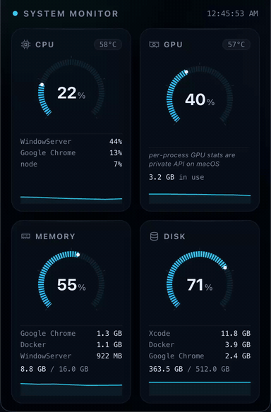

# Pulsebar

A menu bar system monitor for macOS with a glass HUD dashboard: live CPU, GPU,
RAM, and Disk gauges, top processes, and native alerts. Universal binary
(Apple Silicon + Intel). Built with [Tauri](https://tauri.app/) 2 and SvelteKit.



## Install

```bash
brew tap inajaf/tap
brew install --cask pulsebar
```

Or grab the `.dmg` from [Releases](https://github.com/inajaf/pulsebar/releases)
and drag **Pulsebar** into Applications. The app isn't notarized yet, so on
first launch either right-click → **Open**, or run
`xattr -cr /Applications/Pulsebar.app`. (Homebrew handles this for you.)

## Features

- **Lives in the menu bar** — click the tray icon to toggle the dashboard;
  no dock icon.
- **Arc gauges with severity colors** — cyan → amber at 85% → red at 99%,
  plus temperature and used/total bytes where available.
- **Sparklines** — a one-minute live trend under every gauge.
- **Top 3 lists** — heaviest processes by CPU and by memory, largest
  installed apps by disk size.
- **Smart alerts** — a native notification only when a metric *stays*
  critical (debounced, re-arms with hysteresis).
- **Light footprint** — ~0.2% of one core and ~86 MB RAM while in the
  background (polling slows from 1s to 3s when hidden).

### Sensor support

| Metric | macOS | Windows |
|---|---|---|
| CPU / RAM / Disk | ✅ | ✅ |
| GPU usage | ✅ | ✅ NVIDIA only |
| CPU / GPU temp | — no public API | ✅ NVIDIA / ACPI |

## Development

```bash
npm install
npm run tauri dev    # full app
npm run dev          # UI only in a browser, with demo data
npm run check        # type-check
```

Releases are automated: pushing a `v*` tag builds a universal binary and
publishes it via GitHub Actions (`.github/workflows/release.yml`).

### Layout

- `src/` — SvelteKit dashboard (gauges, cards, sparklines, metrics store)
- `src-tauri/src/sensors/` — per-metric sampling
- `src-tauri/src/lib.rs` — app setup, polling loop; `tray.rs`, `notify.rs`,
  `state.rs` — tray, alerts, shared state
